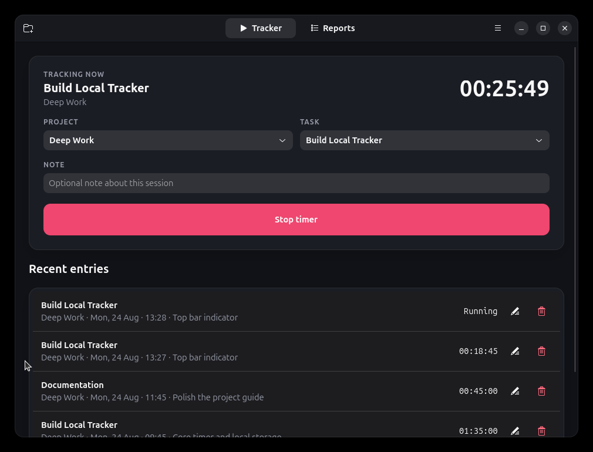
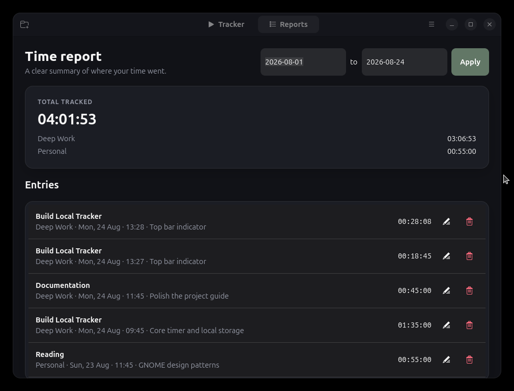

# Local Tracker

A focused, dark-mode time tracker for GNOME. Local Tracker has no account,
network integration, analytics, or server. Projects, reusable tasks, notes, and
time entries are stored in one local JSON file with atomic writes and a backup.

## Screenshots

The screenshots use demonstration data only.

### Tracker



### Reports



## Features

- Start, stop, switch, edit, and delete time entries
- Reusable tasks grouped by colored projects
- Project totals and date-range reports
- Persistent GNOME tray controls for start, stop, show, and quit
- Closing the window hides it while the tray process stays available
- Crash-safe active timer restoration
- Native GTK 4 and libadwaita interface
- Flatpak sandbox with no network permission

## Development with uv

The Python version and development tools are managed with
[uv](https://docs.astral.sh/uv/). GTK and libadwaita are native system
dependencies:

```sh
sudo apt install python3-gi gir1.2-gtk-4.0 gir1.2-adw-1
uv venv --python /usr/bin/python3 --system-site-packages
uv sync
uv run local-tracker
```

Data is stored at `$XDG_DATA_HOME/local-tracker/data.json`, or
`~/.local/share/local-tracker/data.json` when `XDG_DATA_HOME` is unset.
The Flatpak additionally keeps the latest 50 recovery snapshots in
`~/.local/share/local-tracker-backups/`. This directory is outside the source
repository and Flatpak's private data, so it is not pushed to Git and survives
application-data removal. If the live file is missing or damaged, the newest
valid snapshot is restored automatically on launch.

## Add to Ubuntu applications

For a native per-user installation that appears in Ubuntu's application
overview:

```sh
./scripts/install-user.sh
```

Re-run this command after changing the source. No administrator access is
required. Installing the Flatpak also registers the application automatically.

## Test

The data and business-logic tests do not require GTK:

```sh
uv run pytest
```

## Build the Flatpak

Install `flatpak-builder` and the GNOME 48 SDK, then run:

```sh
flatpak-builder --user --install --force-clean build-dir \
  flatpak/io.github.localtracker.LocalTracker.yml
flatpak run io.github.localtracker.LocalTracker
```

The Flatpak stores its data under the standard sandbox data directory. Removing
the application does not remove that data unless Flatpak is explicitly asked to
delete application data.
